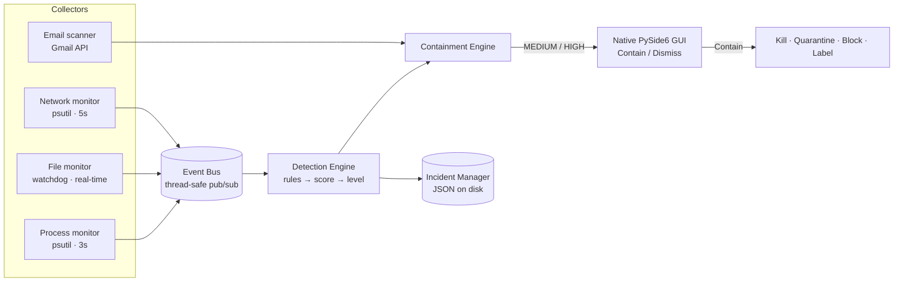

<!--
  MalTracer — Final Project Presentation Source
  ---------------------------------------------
  This README is written as presentation-ready content. Each "## Slide N" heading
  maps to one slide. Bullets are speaker-ready talking points; tables, diagrams,
  and the demo script can be dropped straight into a deck. Design/branding notes
  are in <!-- comments --> so they don't render in text.

  Theme suggestion: dark, security/EDR aesthetic — deep navy (#14161f) background,
  electric blue (#4f7ef8) accent, danger red (#f0524d) / warn amber (#e6a53a) /
  ok green (#2fbf78) for the LOW/MEDIUM/HIGH language. Shield/lock iconography.
-->

# MalTracer
### Endpoint Detection & Response — see the threat, decide the response.

<!-- SLIDE: Title. Big product name + shield logo. Subtitle = the tagline above.
     Footer: team names + course/date. -->

A single, always-on desktop security app for Windows & Linux that watches your
**processes, files, network, and inbox** in real time, scores every event, and puts
the **contain-or-dismiss decision in your hands** — packaged as one double-clickable app.

**At a glance:** Python + native PySide6 GUI · 50 detection rules · encrypted
credential storage · 110 automated tests · one-folder PyInstaller build (no Python,
no Node.js required on the target machine).

---

## Slide 1 — The Problem

<!-- One strong problem statement + 3 supporting bullets. Consider a "kill chain" graphic. -->

Modern attacks unfold on the **endpoint** — a dropped executable, an encoded
PowerShell command, a beacon to a command-and-control server, a phishing email.

- **Detection is scattered.** Process, file, network, and email signals live in
  different tools; defenders lack one place to see them together.
- **Automation over-reacts.** Fully automatic EDR can kill legitimate processes or
  quarantine system files — false positives are expensive and scary.
- **Real tools are hard to run.** Commercial EDR is heavy, cloud-tied, and not
  something a student or small user can just install and understand.

> **Goal:** a lightweight, transparent EDR you can double-click, that shows exactly
> what it sees and lets a human make the call.

---

## Slide 2 — The Solution: MalTracer

<!-- Product hero shot: screenshot of the dashboard. 3–4 pillars. -->

MalTracer unifies four detection surfaces behind **one native dashboard**:

| Pillar | What it does |
|--------|--------------|
| **Monitor** | Processes, files, network connections, and Gmail — all live, in one process |
| **Score**   | Every event is matched against text rules and scored 0–100 |
| **Decide**  | LOW logs silently; MEDIUM & HIGH raise an interactive **Contain / Dismiss** prompt |
| **Act**     | On *Contain*: kill process · quarantine file · block IP · (email) label + trash |

**Design principle: human-in-the-loop.** Nothing is contained automatically —
MalTracer surfaces the threat with full context; the analyst decides.

---

## Slide 3 — Live Demo (script for the presentation)

<!-- This is your demo runbook. Keep the app running; use a second terminal. -->

**Setup:** `python maltracer.py` → the dashboard opens; Process/File/Network show
*running*. (Run the terminal as Administrator to enable firewall blocking.)

1. **LOW (silent log)** — create a watched file:
   `type nul > "%APPDATA%\demo_low.exe"` → appears in the Alerts list as Info.
2. **MEDIUM (you decide)** — encoded PowerShell:
   `powershell -enc UwB0AGEAcgB0AC0AUwBsAGUAZQBwACAANgA=` → **Contain/Dismiss popup**.
   Click **Dismiss** → note it won't ask again for that same threat.
3. **HIGH (urgent, still your call)** — drop a dummy executable that looks like a
   dropper: `mkdir "%USERPROFILE%\Downloads\Temp\Startup" & type nul > "%USERPROFILE%\Downloads\Temp\Startup\demo_high.exe"`
   → HIGH prompt → click **Contain** → watch it quarantine the file (see the
   **Quarantined** tile increment).
4. **Email** — click **Connect Gmail**, authorize in the browser, watch inbox
   threats populate; open the **Scan Email** tab and drop a `.eml` for offline analysis.
5. **Tray** — close the window → it keeps monitoring in the system tray, and a
   toast fires on the next alert.

---

## Slide 4 — The Dashboard (native, in-process)

<!-- Screenshot with callouts. Emphasize: no browser, no Node — real desktop app. -->

Three screens, one window:

- **Dashboard** — threat-level banner, **live stats** (running processes, files
  watched, quarantined, open incidents), per-monitor status, admin banner.
- **Alerts** — live, filterable list (**Critical / Warning / Info / Resolved**),
  per-row Contain/View, incident detail with detection reasons.
- **Scan Email** — drag-and-drop a `.eml` for real, offline phishing analysis.

Plus **system-tray icon**, **native Windows toasts**, and **minimize-to-tray** so
monitoring never stops.

---

## Slide 5 — How It Works (architecture)

<!-- Render this mermaid diagram as the architecture slide. -->



- Collectors run as **daemon threads**; a single **event bus** dispatches to the
  detection engine — one slow or crashing handler can't take down the app.
- The GUI subscribes **in-process** (no localhost server, no IPC) and blocks the
  containment thread only while it waits for your Contain/Dismiss decision.

---

## Slide 6 — Detection Engine

<!-- Show the scoring ladder + a couple of real rule examples. -->

Human-readable text rules (`detection_engine/rules/*.rules`) → matched against each
event → additive score → severity level.

```
IF process_name == powershell.exe AND command_line contains -enc   THEN score +40
IF event_type == file_created AND path contains Startup            THEN score +40
IF dst_port in [4444,1337,6666,9001]                              THEN score +30
```

| Score | Level | Meaning | Action |
|------:|:-----:|---------|--------|
| 0     | INFO  | Nothing matched | — |
| 1–39  | **LOW**    | Noise / low-risk | Logged silently |
| 40–79 | **MEDIUM** | Suspicious | **You choose** Contain / Dismiss |
| ≥ 80  | **HIGH**   | Likely malicious | **You choose** (higher urgency) |

**50 rules** loaded at startup covering LOLBins, encoded PowerShell, dropper paths,
credential dumping, C2 ports, ransomware-style file activity, and more.

---

## Slide 7 — Containment (human-in-the-loop)

<!-- Emphasize the design choice. Before/after: "auto" vs "analyst-decided". -->

- **Nothing auto-contains.** Both MEDIUM and HIGH raise the same interactive prompt;
  actions run **only on your confirmation**.
- On **Contain**: terminate the process tree → quarantine the file (moved, hashed
  SHA-256, set read-only) → block the IP (Windows Firewall / iptables).
- On **Dismiss**: no action — and MalTracer **remembers** that exact threat
  (by file/IP/process/sender identity) so it won't nag you again.
- Every incident is persisted to disk with a full audit trail
  (`OPEN → CONTAINED / DISMISSED`).

<!-- Talking point: this is the key differentiator vs naive auto-EDR — safety + trust. -->

---

## Slide 8 — Email Threat Scanning

<!-- Screenshot of an email alert / the Scan Email tab. -->

- Connects to **Gmail via OAuth2** — the user just clicks *Connect* and approves in
  the browser; no config files to touch.
- Each message is scored: phishing keywords, **SPF/DKIM/DMARC** failures, and
  suspicious URLs (raw-IP, punycode, look-alike TLDs like `.zip`/`.mov`).
- Flagged mail prompts **Contain** (label `MALTRACER-THREAT` + move to Trash) or
  **Dismiss** — consistent with device threats.
- **Scan Email** tab analyzes any local `.eml` offline (real analyzer, not a mock).

---

## Slide 9 — Security & Privacy by Design

<!-- Security slide — auditors love this. -->

- **Encrypted credentials at rest.** The Gmail token is stored in the OS keystore
  (**Windows Credential Manager / DPAPI**, Secret Service on Linux) via `keyring` —
  never in a plaintext file, never in source. Chunked to fit OS size limits.
- **Least surprise.** No silent destructive actions; the analyst approves containment.
- **Graceful privilege degradation.** Runs without admin; the dashboard shows exactly
  which features are reduced and offers a one-click **Restart as Administrator** (UAC).
- **Local-first.** Detection, scoring, quarantine, and incident logs all stay on the
  device (`%APPDATA%\MalTracer\`).

---

## Slide 10 — Technology Stack

<!-- Logos grid: Python, Qt, psutil, watchdog, Google, keyring, PyInstaller. -->

| Layer | Technology |
|-------|-----------|
| Language | **Python 3.10+** (validated on 3.14) |
| Desktop UI | **PySide6 (Qt)** — native window, system tray, toasts |
| Monitoring | **psutil** (process/network), **watchdog** (files) |
| Email | **Google API** (OAuth2 + Gmail), **BeautifulSoup** |
| Secrets | **keyring** (Windows Credential Manager / Secret Service) |
| Packaging | **PyInstaller** (one-dir Windows build) |
| Quality | **pytest** — 110 automated tests |

Concurrency: daemon threads + a thread-safe event bus; Qt signals marshal
cross-thread updates safely onto the GUI thread.

---

## Slide 11 — Packaging & Distribution

<!-- Show the "folder with an exe" concept. -->

- One command — `build.bat` — produces `dist\MalTracer\MalTracer.exe` plus its
  dependency folder (~ tens of MB). **Zip and ship.**
- The end user **unzips and double-clicks** — no Python, no Node.js, no setup.
- Reproducible via a committed **`MalTracer.spec`** (bundles rules, logs, the OAuth
  client, and Qt plugins; declares all hidden imports).
- A hidden `--selftest` flag boots every subsystem and exits 0 — used to smoke-test
  each build.

---

## Slide 12 — Quality & Testing

<!-- Metric slide: big "110" number. -->

- **110 automated tests** (pytest) across the event bus, incident manager,
  detection/containment routing, process killer, quarantine, network blocker,
  credential store, auth flow, resource resolution, and dismiss-suppression.
- Verified **end-to-end from the packaged `.exe`**: 50 rules loaded from the bundle,
  monitors published real events (0 errors), and a **live Gmail inbox was scanned** —
  all with no Python installed.
- Windows-hardened: UTF-8 console logging, `_MEIPASS` resource paths, and
  retry-on-lock file moves (antivirus-friendly).

---

## Slide 13 — Engineering Challenges We Solved

<!-- Story slide — shows depth. Pick 3–4 to narrate. -->

- **Killing the Node.js dependency.** Replaced the Electron popup with a native
  PySide6 GUI running *in-process* — deleted the localhost HTTP bridge entirely and
  made single-file packaging possible.
- **Bleeding-edge Python (3.14).** Chose Qt's stable-ABI wheel and pure-Python
  keyring so everything installs and freezes cleanly on a brand-new interpreter.
- **Safe containment.** Discovered that naive HIGH auto-containment could quarantine
  a *system binary* — redesigned to human-decided containment with threat-identity
  suppression.
- **Windows realities.** Fixed console Unicode crashes, windowed-build `stdout`,
  and AV-lock file-move flakiness (retry with backoff).

---

## Slide 14 — Limitations & Future Work

<!-- Honesty slide — graders respect this. -->

**Known limitations (documented in `CHANGES.md`):**
- Unsigned EDR executables trip **SmartScreen / antivirus** on other machines →
  real distribution needs a purchased **code-signing certificate**.
- Gmail OAuth for other users requires the Google Cloud app to be **verified** or
  those users added as **test users**.

**Future work:**
- Code signing + auto-update; behavioral/ML scoring; YARA rule support;
  central incident dashboard; cross-endpoint fleet view; scheduled scans.

---

## Slide 15 — Summary

<!-- Closing slide: restate the one-liner + the 4 pillars + the "110 tests / one exe" proof points. -->

MalTracer is a **complete, working EDR**: it unifies process, file, network, and
email detection behind a **native dashboard**, scores every event, and keeps the
**human in control** of every response — delivered as a **single double-clickable
Windows app**, backed by **110 passing tests**.

> **See the threat. Decide the response.**

---

# Appendix — Run it yourself

### For end users (Windows, zero setup)
1. Unzip the `MalTracer` folder.
2. Double-click **`MalTracer.exe`** — the dashboard opens and monitoring starts.
3. *(Optional)* Click **Connect Gmail account** and approve in the browser.
   Close the window and it keeps running in the **system tray**.

### For developers (run from source)
```bash
pip install -r requirements.txt      # Python 3.10+
python maltracer.py                  # unified always-on app (default)
python maltracer.py --simulate       # replay recorded EDR logs into the GUI
python maltracer.py --status         # print incident counts
python -m pytest tests/ -v           # 110 passed
```

### Build the distributable (Windows)
```bat
build.bat                            # → dist\MalTracer\MalTracer.exe  (zip & ship)
```

### Where data lives
`%APPDATA%\MalTracer\` → `incidents\`, `quarantine\`, `logs\maltracer.log`
(Gmail token is in Windows Credential Manager, not on disk.)

---

## Project structure
```
maltracer.py                 Entry point — run_app() default + advanced flags
app/                         Native PySide6 GUI (main_window.py, style.py)
core/                        engine · event_bus · incident_manager
monitoring/                  process_monitor · file_monitor · network_monitor
detection_engine/            engine · scoring · classifier · rule_engine + rules/
containment/                 containment_engine · process_killer · quarantine · network_blocker
alerts/                      popup_handler (GUI bridge) · suppression (dismiss memory)
email_scanner/               service · auth · credential_store · analyzer · gmail · actions
utils/                       constants · resources (_MEIPASS) · privileges (UAC)
logging_system/logger.py     Structured JSON logger
logs/                        Recorded dataset used by --simulate
tests/                       110 automated tests
MalTracer.spec, build.bat    Packaging
legacy/                      Archived Electron popup + old static dashboards
CHANGES.md                   Full engineering change log
```

---

## Team

**Mohamed Yahia · Marwan Samy · Rodina Mohamed · Youssef Samir · Shenoda Amir**

<!-- Design note: end deck with team slide + a "Questions?" slide reusing the shield logo. -->
